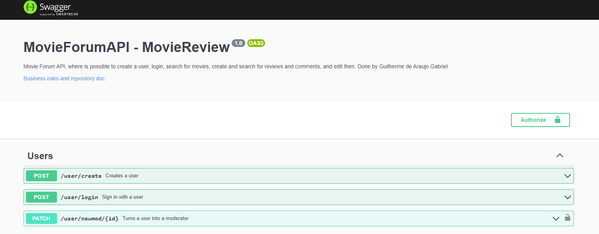
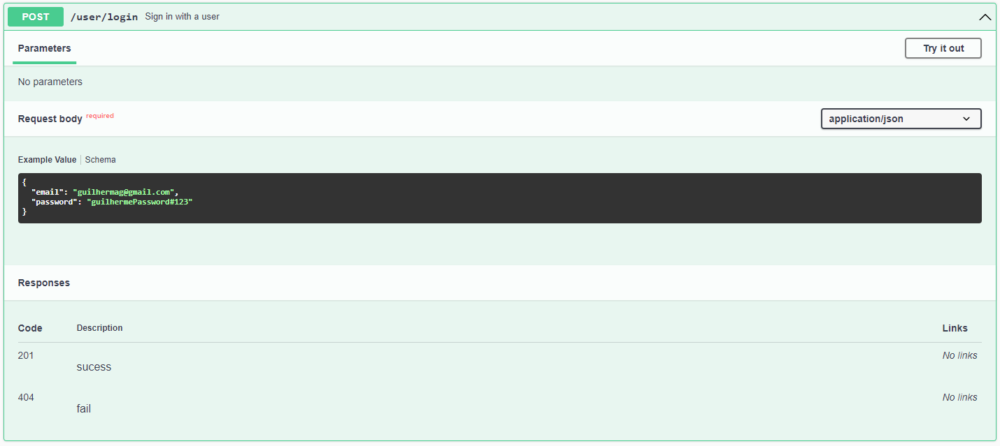

# Swagger Guide

## Description

Swagger is a simple form of creating a UI where is possible to see all the api endpoints, the possible responses and the required parameters for an endpoint in expecific.

For this app the default screen of swagger is showed below.



Because the app works with a JWT validation, some endpoints will not be available if a valid token is not set on this page.


The token can be obtained through the sign in endpoint ```/user/login```.



Sending the correct credentials of a real user it's possible to get the access token obtained through the response of this endpoint.


Now just click on the ```Authorize``` button in the top right side of the page.


Paste the access token and click on ```Authorize```.


