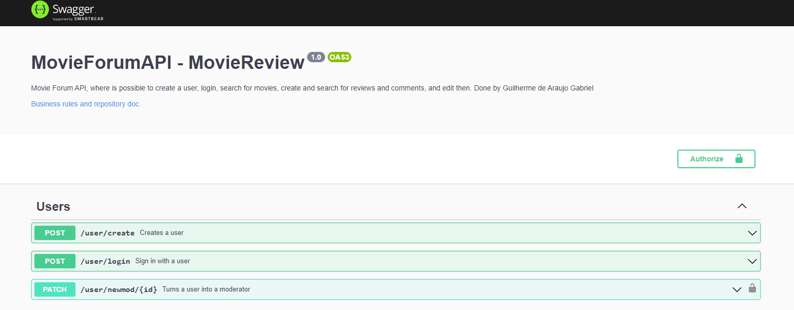
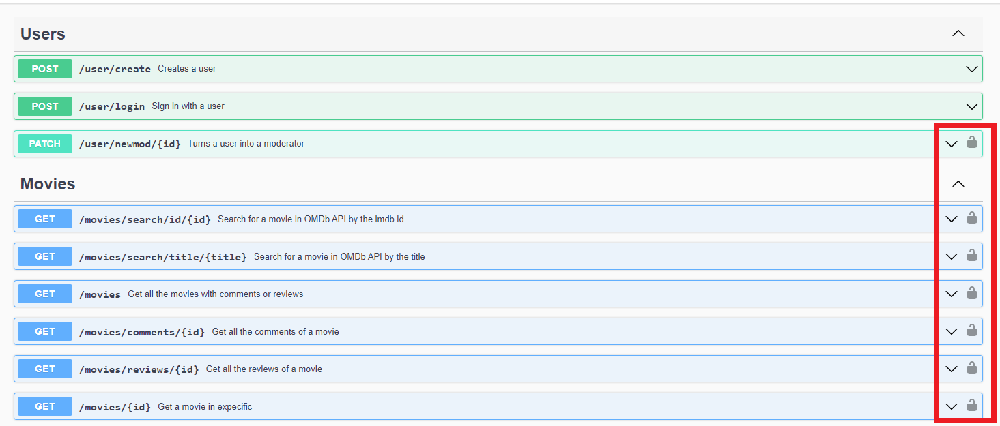
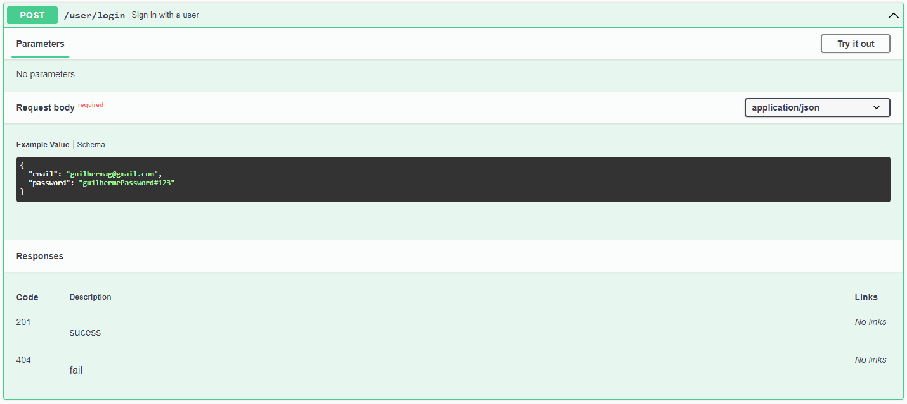
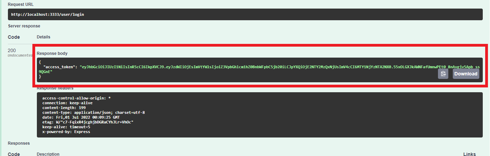
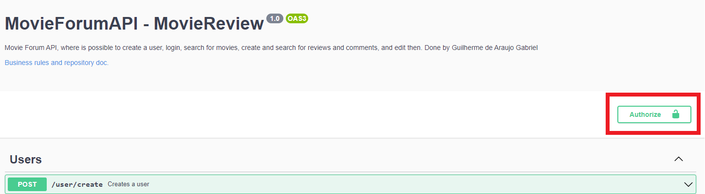
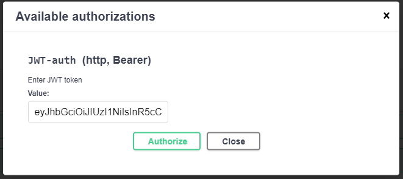

# Guia Swagger

## Descrição

O swagger é uma forma simples de criar uma UI aonde é possível ver todos os endpoints da aplicação, as possíveis respostas e os parâmetros necessários para um endpoint em particular.

Para esse app a tela padrão do swagger é mostrada abaixo.



Como o sistema usa a autenticação com um token JWT, alguns endpoinst não estarão disponíveis a menos que um token válido seja informado.



O token pode ser obtido pelo endpoint ```/user/login```.



Fornecendo as credenciais válidas de um usuário já existente é possível obter o token na resposta da requisição.



Agora clique no botão ```Authorize``` no canto superior direito.



Cole o token no campo value e aperte o botão ```Authorize```.

